# 高校综合信息管理系统结项报告

## 基本信息

| 项目 | 内容 |
| --- | --- |
| 项目名称 | 高校综合信息管理系统 |
| 学院 | 计算机学院 |
| 小组序号 | 32 |
| 成员姓名 | 钟磊 / 仇欣皓 / 曹伟 / 罗旭 / 金凡竣 |
| 指导老师 | 尹兆远 |
| 当前版本 | 结项版 |
| 更新日期 | 2026年5月16日 |

## 一、项目概述

### 1. 项目背景

高校日常管理包含用户账号、组织部门、学生档案、教师档案、课程信息、通知公告、业务申请、附件材料和日志审计等多类数据。若长期依靠表格、文件夹和人工消息传递进行管理，容易出现数据重复录入、查询效率低、权限边界不清晰、审批过程难追踪、附件材料散落以及操作责任难定位等问题。

本项目面向高校信息化管理场景，设计并实现一套基于 Web 的综合信息管理系统。系统以统一登录认证、角色权限控制、基础数据维护、业务数据管理、申请审批、附件管理和日志审计为主线，将分散的数据和操作整合到同一平台中，提升数据维护效率、业务处理规范性和系统操作可追溯性。

### 2. 系统目标

本系统的建设目标如下：

- 建立统一登录入口，实现基于 JWT 的身份认证。
- 建立用户、角色、菜单、按钮权限组成的 RBAC 权限体系。
- 实现后端动态菜单渲染和前端按钮级权限控制。
- 实现部门、学生、教师等基础数据的增删改查。
- 实现学生和教师的导入、导出、批量删除和账号绑定。
- 实现课程、公告、申请等核心业务模块。
- 实现申请提交、撤回、审批通过、审批驳回和流转记录查询。
- 实现附件上传、下载、删除和业务记录删除后的附件联动清理。
- 实现工作台实时统计、登录日志和操作日志。
- 完成前后端联调、自动化测试用例、部署说明和课程文档。

### 3. 开发环境

| 类别 | 方案 |
| --- | --- |
| 前端开发工具 | HBuilder X、VS Code |
| 后端开发工具 | IntelliJ IDEA 2024.3.2 |
| 前端技术 | Vue 3、JavaScript、Vite、Pinia、Vue Router、Element Plus、Axios |
| 后端技术 | Java 17、Spring Boot 3、Spring Security、JWT、MyBatis XML |
| 数据库 | MySQL 8.0 |
| 测试工具 | JUnit 5、Spring Boot Test、Playwright |
| 部署方案 | Ubuntu、Nginx、systemd、MySQL |
| 版本管理 | Git、GitHub、Pull Request 协作流程 |

## 二、需求分析

### 1. 用户角色

| 用户角色 | 主要职责 |
| --- | --- |
| 系统管理员 | 维护用户、角色、菜单、部门、系统日志和全部业务数据 |
| 教师用户 | 查看教师相关业务，参与申请提交、审批和部分业务数据查看 |
| 业务管理员 | 维护学生、教师、课程、公告、申请和附件信息 |
| 测试人员 | 验证系统功能、权限边界、页面交互和部署文档 |

### 2. 功能需求

系统最终功能按模块划分如下：

| 序号 | 功能模块 | 功能说明 |
| --- | --- | --- |
| 1 | 登录认证 | 账号密码登录、退出登录、JWT 令牌签发、登录日志记录 |
| 2 | 个人中心 | 当前用户信息展示、修改密码 |
| 3 | 工作台 | 用户、学生、教师、课程、申请、待办等实时统计 |
| 4 | 用户管理 | 分页查询、新增、编辑、删除、状态切换、重置密码、分配角色 |
| 5 | 角色管理 | 分页查询、新增、编辑、删除、状态切换、分配菜单和按钮权限 |
| 6 | 菜单管理 | 菜单树维护、路由配置、按钮权限码维护 |
| 7 | 部门管理 | 部门树查询、新增、编辑、删除、部门下拉 |
| 8 | 学生管理 | 学生查询、新增、编辑、删除、批量删除、导入、导出、创建账号 |
| 9 | 教师管理 | 教师查询、新增、编辑、删除、批量删除、导入、导出、创建账号 |
| 10 | 课程管理 | 课程查询、新增、编辑、删除、教师关联、附件关联 |
| 11 | 公告管理 | 公告查询、新增、编辑、发布、撤回、删除、附件关联 |
| 12 | 申请管理 | 申请查询、新增、编辑、提交、撤回、审批、流转记录查询 |
| 13 | 工作流 | 待办查询、已办查询、审批通过、审批驳回 |
| 14 | 附件管理 | 附件上传、下载、删除、按业务对象查询 |
| 15 | 日志管理 | 登录日志查询、操作日志查询 |

### 3. 业务流程

登录与权限流程：

1. 用户进入登录页面并输入账号、密码。
2. 后端校验账号状态和密码。
3. 校验成功后签发 JWT，并返回当前用户信息、角色、菜单和权限码。
4. 前端保存 token，根据后端菜单数据渲染左侧导航。
5. 前端根据权限码控制按钮显示，后端根据权限码进行接口鉴权。
6. 用户退出或 token 失效后重新登录。

业务申请流程：

1. 用户进入申请管理页面新建申请。
2. 用户填写申请类型、申请对象、原因等信息。
3. 用户可上传附件并与申请记录绑定。
4. 用户提交申请，系统生成审批流转记录。
5. 审批人员在工作流待办中查看申请。
6. 审批人员执行通过或驳回操作。
7. 系统更新申请状态，记录审批意见和处理时间。

附件管理流程：

1. 用户在课程、公告、申请等业务页面上传附件。
2. 后端保存文件到本地存储目录。
3. 后端写入附件元数据，包括业务类型、业务 ID、文件名、文件大小、上传人等。
4. 前端在业务列表和详情中展示附件数量或附件列表。
5. 删除业务记录时，后端同步清理关联附件元数据和物理文件。

### 4. 非功能需求

| 类别 | 要求与实现 |
| --- | --- |
| 性能要求 | 列表数据统一分页查询，避免一次性加载大量数据 |
| 安全要求 | 使用 JWT 认证、Spring Security 鉴权、BCrypt 密码摘要、日志脱敏 |
| 兼容性要求 | 前端支持现代 Chromium 内核浏览器，后端基于 JDK 17 运行 |
| 可维护性要求 | 前后端按模块组织目录，接口统一 RESTful 风格，响应结构统一 |
| 可测试性要求 | 后端集成测试覆盖核心接口，前端 Playwright 覆盖登录、导航和权限链路 |
| 可部署性要求 | 支持 Nginx 托管前端、systemd 管理后端、MySQL 备份恢复 |

## 三、系统设计

### 1. 系统架构

系统采用前后端分离架构，整体分为表现层、接口层、业务层、数据访问层、数据存储层和部署运维层。

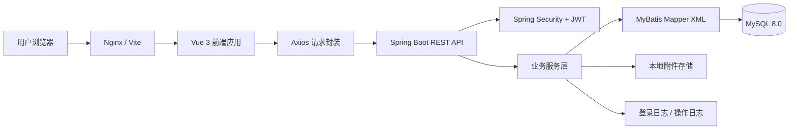

前端负责页面展示、表单交互、路由守卫、动态菜单渲染、按钮权限控制和接口调用。后端负责登录认证、接口鉴权、业务规则校验、数据库访问、附件处理、日志记录和统一异常处理。数据库负责保存系统配置、业务数据、审批记录、附件元数据和日志数据。

### 2. 模块设计

| 模块 | 主要职责 | 主要目录 |
| --- | --- | --- |
| 认证模块 | 登录、当前用户、动态菜单、权限码、修改密码 | `modules/auth` |
| 用户模块 | 用户 CRUD、状态切换、重置密码、角色分配 | `modules/system/user` |
| 角色模块 | 角色 CRUD、状态维护、菜单权限分配 | `modules/system/role` |
| 菜单模块 | 菜单树、路由、按钮权限码维护 | `modules/system/menu` |
| 部门模块 | 部门树、部门下拉、部门 CRUD | `modules/organization/department` |
| 学生模块 | 学生档案、导入导出、批量删除、账号绑定 | `modules/personnel/student` |
| 教师模块 | 教师档案、导入导出、批量删除、账号绑定 | `modules/personnel/teacher` |
| 课程模块 | 课程 CRUD、教师关联、附件联动 | `modules/business/course` |
| 公告模块 | 公告 CRUD、发布撤回、附件联动 | `modules/business/notice` |
| 申请模块 | 申请 CRUD、提交撤回、审批状态和流转记录 | `modules/business/application` |
| 工作流模块 | 待办、已办、审批通过、审批驳回 | `modules/workflow` |
| 附件模块 | 上传、下载、删除、业务附件查询 | `modules/file/attachment` |
| 工作台模块 | 统计卡片、待办事项、趋势数据 | `modules/dashboard` |
| 日志模块 | 登录日志、操作日志查询 | `modules/system/log` |

### 3. 数据库设计

系统数据库使用 MySQL 8.0，字符集采用 `utf8mb4`。初始化脚本位于 `backend/src/main/resources/db/migration/`。主要数据表如下：

| 类型 | 数据表 |
| --- | --- |
| 权限组织 | sys_user、sys_role、sys_menu、sys_department、sys_user_role、sys_role_menu |
| 人员档案 | biz_student、biz_teacher |
| 核心业务 | biz_course、biz_notice、biz_application |
| 工作流 | biz_application_record |
| 附件 | biz_attachment |
| 日志 | sys_login_log、sys_operation_log |

核心关系如下：

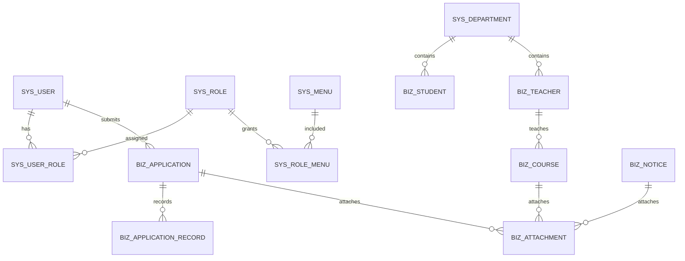

主要表字段摘要如下：

| 表名 | 说明 | 关键字段 |
| --- | --- | --- |
| sys_user | 用户账号表 | username、password_hash、real_name、user_type、dept_id、status |
| sys_role | 角色表 | role_code、role_name、data_scope、status |
| sys_menu | 菜单和按钮权限表 | parent_id、menu_name、menu_type、route_path、permission_code |
| sys_department | 部门表 | parent_id、dept_code、dept_name、dept_type、status |
| biz_student | 学生表 | student_no、student_name、dept_id、major_name、grade_year、class_name、user_id |
| biz_teacher | 教师表 | teacher_no、teacher_name、dept_id、title_name、user_id |
| biz_course | 课程表 | course_code、course_name、dept_id、teacher_id、credit、semester |
| biz_notice | 公告表 | title、notice_type、content、publish_status、publisher_id |
| biz_application | 申请表 | applicant_user_id、application_type、target_name、reason、status |
| biz_application_record | 审批记录表 | application_id、step_no、approver_id、action_type、before_status、after_status |
| biz_attachment | 附件表 | biz_type、biz_id、file_name、content_type、file_size、object_key |
| sys_login_log | 登录日志表 | username、login_ip、browser、os、login_status、login_at |
| sys_operation_log | 操作日志表 | module_name、operation_type、request_uri、operator_name、result_status |

## 四、系统实现

### 1. 关键技术

#### 1.1 JWT 登录认证

系统登录成功后，后端生成 JWT 并返回给前端。前端在后续请求中通过 `Authorization: Bearer <token>` 携带令牌。后端过滤器解析 token，恢复当前登录用户信息，并将权限码交给 Spring Security 用于接口鉴权。

#### 1.2 RBAC 权限控制

系统通过用户、角色、菜单和按钮权限码构建 RBAC 权限模型。管理员可以为用户分配角色，为角色分配菜单和按钮权限。前端通过后端返回的菜单树动态渲染导航，通过权限码控制按钮显隐；后端通过 `@PreAuthorize` 进行接口级权限控制，保证权限边界不依赖前端。

#### 1.3 MyBatis XML 数据访问

后端采用 Mapper 接口和 XML 文件分离 SQL。列表接口支持分页、条件查询和关联查询，学生、教师、课程、公告、申请、附件、日志等模块均采用统一的 Controller、Service、Mapper 分层结构。

#### 1.4 统一响应和异常处理

后端接口统一返回 `ApiResponse`，分页接口统一返回 `PageResponse`。业务异常、参数校验异常、未登录、无权限和系统异常由全局异常处理器统一转换为 JSON 响应，前端据此进行消息提示和页面跳转。

#### 1.5 附件联动清理

附件模块保存附件元数据并管理本地存储文件。课程、公告、申请等业务记录删除时，会调用附件服务清理对应业务类型和业务 ID 下的附件记录及文件，避免产生无效附件。

#### 1.6 前端动态路由与权限按钮

前端使用 Vue Router、Pinia 和后端菜单数据生成动态路由。登录后将 token、用户信息、菜单树和权限码保存到状态管理中，页面按钮通过权限码判断是否显示，路由守卫负责登录态检查和异常页面跳转。

### 2. 界面展示

以下截图展示系统结项版主要页面和核心交互效果，截图统一存放在 `docs/report/assets/` 目录中，便于在 Markdown、GitHub 和导出的 Word 文档中查看。

#### 图4-1 登录页

登录页提供账号密码登录入口，并在登录失败、未登录访问等场景下配合后端认证接口进行提示和跳转。

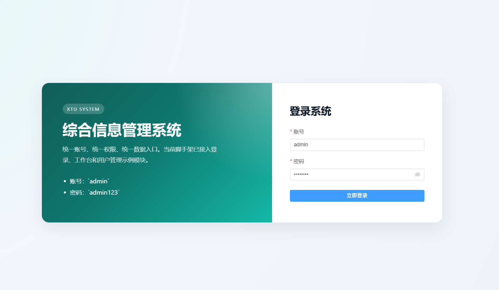

#### 图4-2 工作台

工作台展示用户、学生、教师、课程、申请和待办等实时统计数据，帮助管理员快速了解系统运行状态。

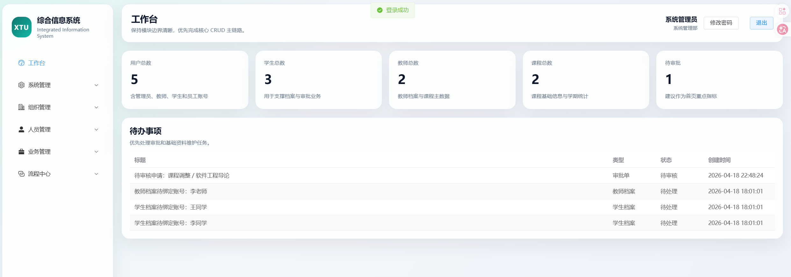

#### 图4-3 用户管理

用户管理页面支持用户查询、新增、编辑、删除、状态切换、重置密码和角色分配等操作。

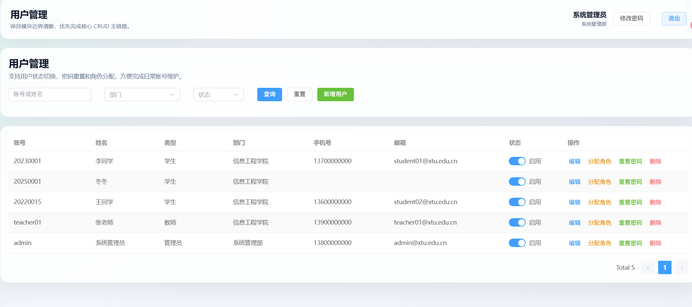

#### 图4-4 角色管理

角色管理页面支持角色维护、状态控制和菜单权限分配，是系统 RBAC 权限体系的核心配置入口。

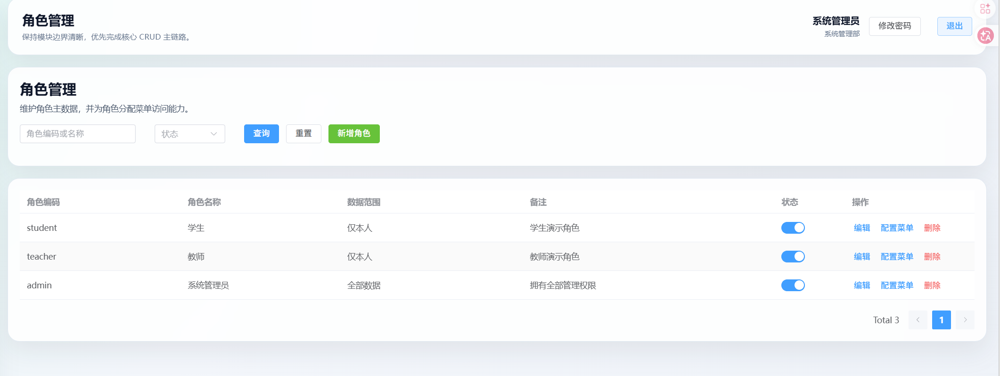

#### 图4-5 菜单管理

菜单管理页面用于维护系统左侧导航、页面路由和按钮权限码，前端根据后端返回的菜单树动态渲染导航。

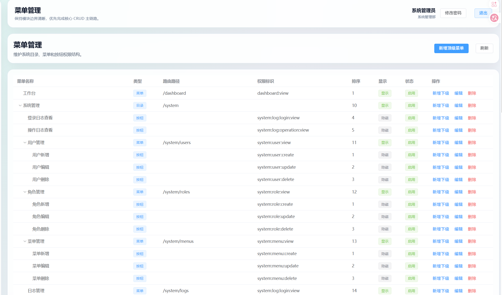

#### 图4-6 部门管理

部门管理页面以组织结构为核心，支持部门数据维护，并为用户、学生、教师、课程等模块提供基础关联数据。

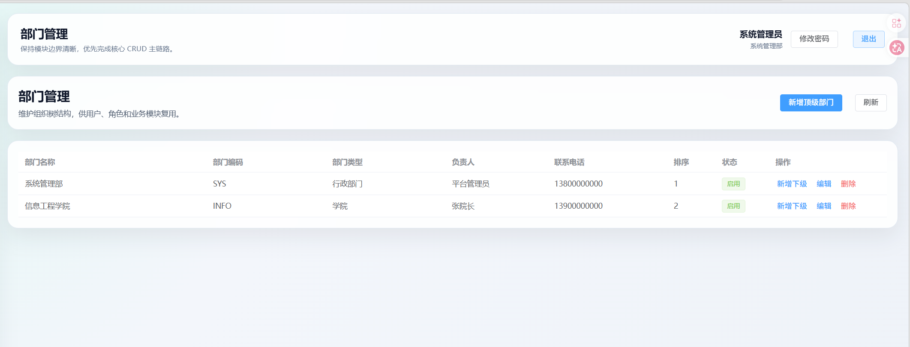

#### 图4-7 学生管理

学生管理页面支持学生档案维护、批量删除、导入导出和创建账号，满足学生基础数据管理需求。

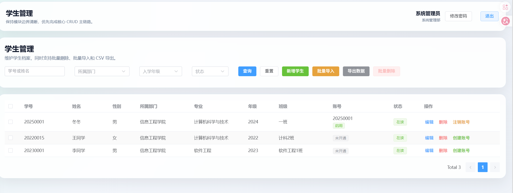

#### 图4-8 教师管理

教师管理页面支持教师信息维护、导入导出、批量删除和账号绑定，并与课程、权限和业务申请等模块形成关联。

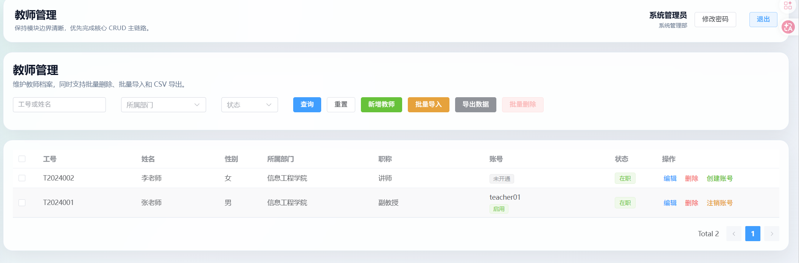

#### 图4-9 课程管理

课程管理页面支持课程查询、新增、编辑、删除、任课教师关联和附件绑定。

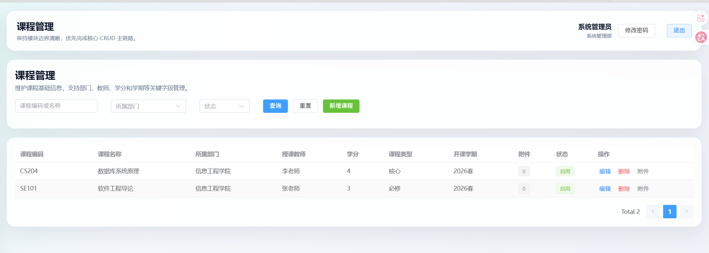

#### 图4-10 公告管理

公告管理页面支持公告草稿、发布、撤回、编辑、删除和附件关联，用于维护系统通知信息。

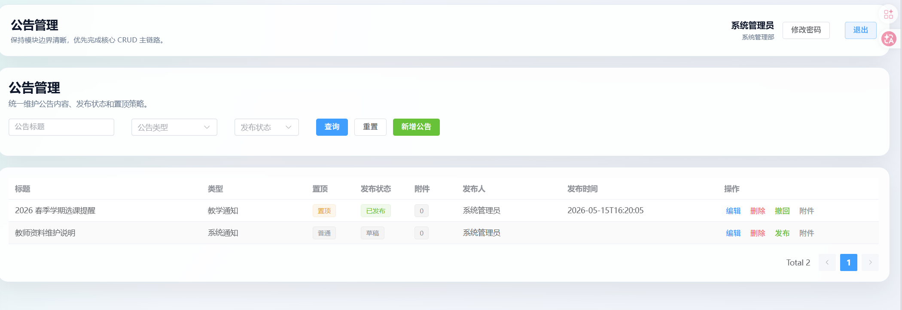

#### 图4-11 申请管理

申请管理页面支持申请新增、编辑、提交、撤回、审批状态查看和附件上传，是业务流程发起入口。

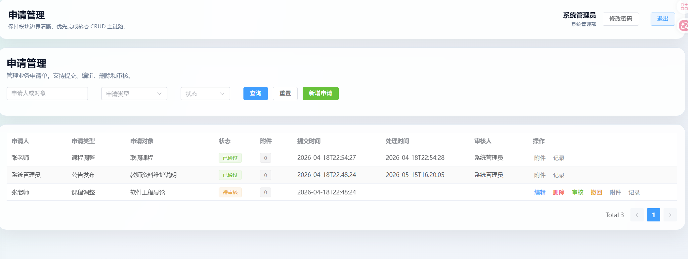

#### 图4-12 审批任务

审批任务页面展示待办和已办申请，支持审批人员查看申请详情并执行通过或驳回操作。

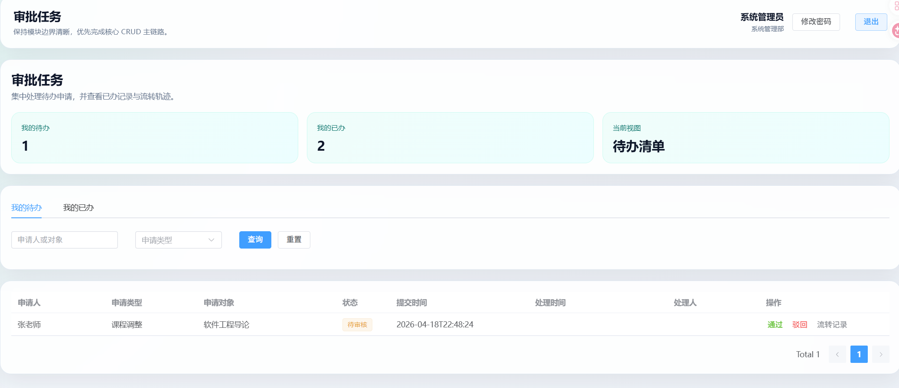

#### 图4-13 附件管理

附件管理页面展示系统内上传的附件信息，支持按业务类型查询、下载和删除。

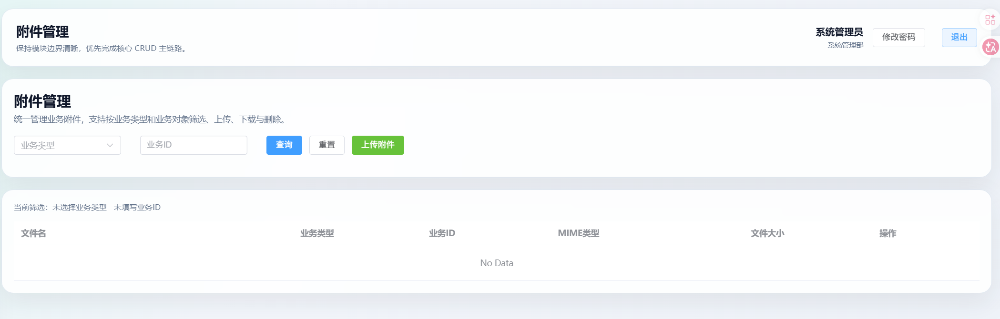

#### 图4-14 日志管理

日志管理页面展示登录日志和操作日志，便于进行系统审计、问题排查和操作追踪。

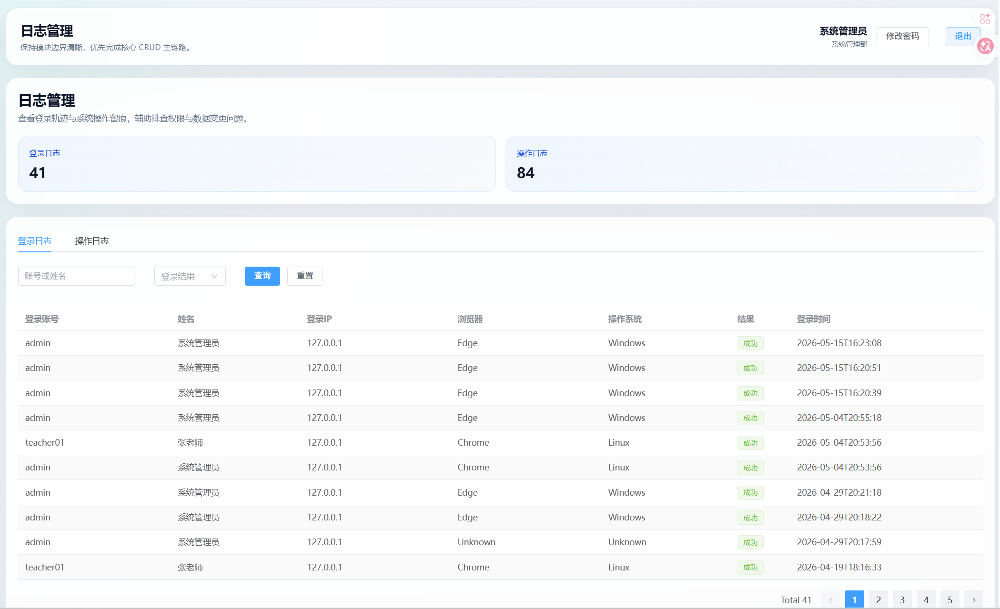

#### 图4-15 修改密码

个人中心提供修改密码能力，用户可在登录后自行更新账号密码。

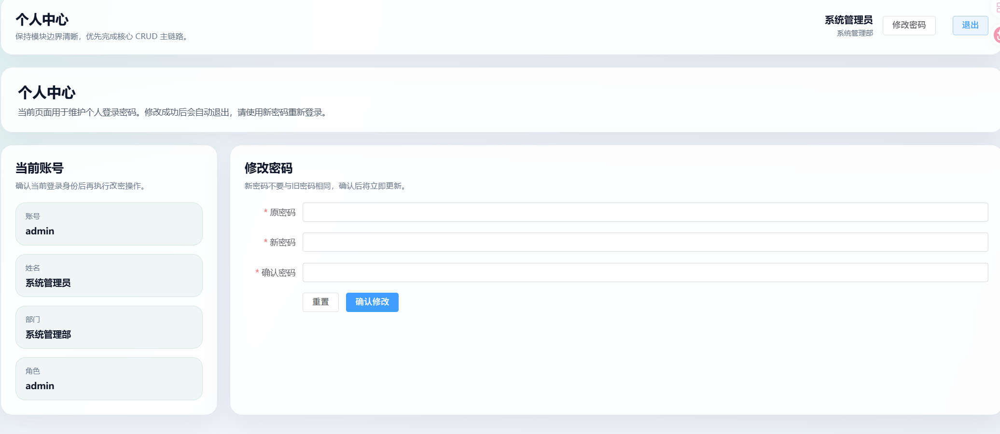

### 3. 核心代码片段

统一响应结构示例：

```java
public class ApiResponse<T> {
    private Integer code;
    private String message;
    private T data;

    public static <T> ApiResponse<T> success(T data) {
        return new ApiResponse<>(200, "操作成功", data);
    }
}
```

分页接口示例：

```java
@GetMapping
@PreAuthorize("hasAuthority('personnel:teacher:view')")
public ApiResponse<PageResponse<TeacherPageItemVO>> getTeacherPage(TeacherQueryRequest request) {
    return ApiResponse.success(teacherService.getTeacherPage(request));
}
```

前端请求拦截示例：

```javascript
request.interceptors.request.use((config) => {
    const token = getToken()
    if (token) {
        config.headers.Authorization = `Bearer ${token}`
    }
    return config
})
```

附件联动清理逻辑示例：

```java
@Transactional(rollbackFor = Exception.class)
public void deleteCourse(Long id) {
    courseMapper.logicDeleteCourse(id, currentUserId);
    attachmentService.deleteByBusiness("course", id);
}
```

以上代码体现了项目统一响应、权限校验、前端 token 注入和业务附件清理的实现方式。

## 五、系统测试

### 1. 测试方案

项目测试分为后端集成测试、前端 E2E 测试、接口联调测试和人工页面回归测试。

| 测试类型 | 测试范围 | 测试工具 |
| --- | --- | --- |
| 后端集成测试 | 登录、工作台、人员账号、业务模块、工作流、附件、日志 | JUnit 5、Spring Boot Test |
| 前端 E2E 测试 | 管理员登录、核心页面访问、教师菜单和权限收敛 | Playwright |
| 接口联调测试 | 请求字段、响应字段、错误提示、权限码 | 浏览器开发工具、前后端本地服务 |
| 页面回归测试 | 表格查询、弹窗表单、新增编辑删除、附件上传下载 | 浏览器人工点测 |
| 部署检查 | 前端构建、后端 jar、Nginx、systemd、MySQL 连接 | Ubuntu 命令行 |

### 2. 自动化测试用例

后端测试与联调配置：

| 文件或方式 | 覆盖内容 |
| --- | --- |
| backend/src/test/resources/application-test.yml | 独立测试库配置 |
| mvn test | 后端测试命令入口 |
| 页面联调和接口回归 | 登录认证、工作台、系统管理、人员管理、业务管理、附件、工作流、日志接口 |

前端 E2E 测试文件：

| 测试文件 | 覆盖内容 |
| --- | --- |
| auth_and_navigation.spec.js | 管理员登录、工作台和核心页面导航 |
| teacher_permissions.spec.js | 教师账号菜单收敛、按钮收敛和接口权限 |

### 3. 测试结果

| 编号 | 测试项 | 预期结果 | 测试结果 |
| --- | --- | --- | --- |
| T-01 | 管理员登录 | 登录成功并进入工作台 | 通过 |
| T-02 | 错误密码登录 | 返回错误提示，不进入系统 | 通过 |
| T-03 | 动态菜单加载 | 菜单按当前用户权限显示 | 通过 |
| T-04 | 用户管理 | 支持状态切换、重置密码、分配角色 | 通过 |
| T-05 | 学生管理 | 支持新增、导入、导出、批量删除、创建账号 | 通过 |
| T-06 | 教师管理 | 支持新增、导入、导出、批量删除、创建账号 | 通过 |
| T-07 | 课程管理 | 支持新增、编辑、删除和附件绑定 | 通过 |
| T-08 | 公告管理 | 支持新增、编辑、发布、撤回、删除和附件绑定 | 通过 |
| T-09 | 申请管理 | 支持新增、提交、撤回、审批和流转记录 | 通过 |
| T-10 | 附件管理 | 支持上传、下载、删除和业务删除联动清理 | 通过 |
| T-11 | 日志管理 | 登录日志和操作日志可查询 | 通过 |
| T-12 | 教师权限 | 教师账号无法访问用户、角色、菜单管理接口 | 通过 |
| T-13 | 前端 E2E | 管理员和教师两条关键链路通过 | 2 passed |

前端 E2E 执行命令：

```bash
cd frontend
npm run test:e2e:install
npm run test:e2e
```

前端 E2E 执行结果记录：

```text
2 passed
```

后端测试执行命令：

```bash
cd backend
DB_USERNAME=root DB_PASSWORD=123456 mvn test
```

### 4. 问题与改进

| 问题 | 处理方式 |
| --- | --- |
| 前后端接口字段容易不一致 | 编写接口字段说明，联调时按接口文档对齐 |
| 权限既涉及前端按钮又涉及后端接口 | 后端权限校验作为最终边界，前端按钮控制只作为体验优化 |
| 附件和业务数据存在关联清理 | 在业务删除逻辑中统一调用附件清理服务 |
| 本地测试依赖 MySQL 服务 | 提供测试配置和环境变量覆盖方式 |
| 部署环境与本地开发环境不同 | 编写 Nginx、systemd、数据库备份恢复和上线检查清单 |

## 六、用户手册

### 1. 安装部署说明

#### 1.1 本地开发运行

准备 MySQL 数据库：

```text
数据库：xtu_system
账号：root
密码：123456
地址：127.0.0.1:3306
```

启动后端：

```bash
cd backend
DB_USERNAME=root DB_PASSWORD=123456 mvn spring-boot:run
```

后端默认地址：

```text
http://localhost:8080
```

启动前端：

```bash
cd frontend
npm install
npm run dev
```

前端默认地址：

```text
http://localhost:5173
```

默认账号：

```text
管理员：admin / admin123
教师：teacher01 / teacher123
```

#### 1.2 原生部署说明

生产部署采用 Nginx + 前端 dist + 后端 jar + MySQL 的方式。

构建后端：

```bash
cd backend
mvn clean package -DskipTests
```

构建前端：

```bash
cd frontend
npm install
npm run build
```

推荐服务器目录：

```text
/opt/xtu-system/
├── backend/
│   ├── xtu-system-backend.jar
│   └── storage/uploads/
├── frontend/
│   └── dist/
├── logs/
└── backup/
```

后端使用 systemd 管理：

```bash
sudo cp deploy/systemd/xtu-system-backend.service /etc/systemd/system/
sudo systemctl daemon-reload
sudo systemctl enable xtu-system-backend
sudo systemctl start xtu-system-backend
```

Nginx 托管前端并代理接口：

```bash
sudo cp deploy/nginx/xtu_system.conf /etc/nginx/conf.d/xtu_system.conf
sudo nginx -t
sudo systemctl reload nginx
```

数据库备份：

```bash
DB_PASSWORD=123456 deploy/scripts/backup_mysql.sh
```

数据库恢复：

```bash
DB_PASSWORD=123456 deploy/scripts/restore_mysql.sh /opt/xtu-system/backup/xtu_system_20260504_200000.sql.gz
```

### 2. 操作指南

#### 2.1 登录系统

1. 打开前端访问地址。
2. 输入账号和密码。
3. 点击登录按钮。
4. 登录成功后进入工作台。
5. 若无权限访问某页面，系统进入 403 页面或显示无权限提示。

#### 2.2 维护用户和权限

1. 管理员进入系统管理中的用户管理。
2. 新增或编辑用户基本信息。
3. 为用户分配角色。
4. 在角色管理中为角色分配菜单和按钮权限。
5. 在菜单管理中维护菜单路由和按钮权限码。
6. 用户重新登录后加载新的菜单和权限。

#### 2.3 维护学生和教师

1. 进入人员管理中的学生管理或教师管理。
2. 使用关键字、部门、状态等条件查询数据。
3. 点击新增或编辑维护人员档案。
4. 使用导入功能批量录入学生或教师数据。
5. 使用导出功能下载当前筛选结果。
6. 可为学生或教师创建系统账号，并与人员档案绑定。

#### 2.4 维护课程、公告和申请

1. 进入业务管理中的课程、公告或申请页面。
2. 使用新增、编辑、删除按钮维护业务数据。
3. 在业务记录中上传附件并查看附件数量。
4. 公告支持发布和撤回。
5. 申请支持提交、撤回、审批通过和审批驳回。
6. 删除业务记录时，系统同步清理关联附件。

#### 2.5 处理工作流

1. 审批人员进入流程中心的审批任务页面。
2. 查看待办申请。
3. 查看申请详情和附件材料。
4. 填写审批意见。
5. 选择通过或驳回。
6. 系统记录流转记录并更新申请状态。

#### 2.6 查看日志

1. 管理员进入日志管理页面。
2. 选择登录日志或操作日志。
3. 按用户名、时间、状态、模块等条件查询。
4. 查看登录 IP、浏览器、操作系统、请求地址、操作结果等信息。

## 七、项目总结

### 1. 成果总结

本项目完成了一套前后端分离的高校综合信息管理系统。系统实现了登录认证、动态菜单、按钮权限、用户管理、角色管理、菜单管理、部门管理、学生管理、教师管理、课程管理、公告管理、申请管理、工作流审批、附件管理、工作台统计、登录日志和操作日志等功能。项目同时补充了数据库设计、接口说明、目录结构说明、部署说明、测试用例和课程报告文档，具备本地运行、演示和继续扩展的基础。

项目最终成果包括：

- 前端 Vue 3 管理端页面。
- 后端 Spring Boot REST API。
- MySQL 初始化脚本和业务表结构。
- JWT 登录认证和 RBAC 权限体系。
- 人员管理和业务管理核心模块。
- 附件、日志、工作流和工作台功能。
- Playwright 前端 E2E 测试和后端集成测试。
- Nginx、systemd、MySQL 备份恢复部署文档。

### 2. 不足与改进方向

| 不足 | 后续改进方向 |
| --- | --- |
| 当前审批流为轻量级单节点流程 | 后续可扩展为多级审批、条件分支和流程配置 |
| 附件存储使用本地目录 | 后续可接入对象存储，提高扩展性和可靠性 |
| 数据统计图表较基础 | 后续可增加更多维度的数据分析和可视化 |
| 导入功能以基础校验为主 | 后续可增强模板下载、错误行标记和导入预览 |
| 权限粒度已支持按钮级 | 后续可继续扩展数据权限和字段权限 |
| 部署方案以单机部署为主 | 后续可扩展容器化、反向代理 HTTPS 和自动化发布 |

### 3. 成员分工表

| 成员 | 班级 | 学号 | Git 账号 | 角色 | 主要任务 |
| --- | --- | --- | --- | --- | --- |
| 罗旭 | 计算机科学与技术一班 | 202405567009 | jcctkl | 前端开发1 | 登录页、主布局、动态菜单、工作台、个人中心 |
| 曹伟 | 计算机科学与技术一班 | 202405567017 | cw749 | 前端开发2 | 用户、角色、菜单、部门、学生、教师、业务页面和附件交互 |
| 仇欣皓 | 计算机科学与技术一班 | 202405567018 | Agoni18 | 后端开发1 | 登录认证、JWT、权限、用户、角色、菜单、部门、日志 |
| 钟磊 | 计算机科学与技术一班 | 202405567015 | l1160 | 后端开发2、架构设计 | 学生、教师、课程、公告、申请、工作流、附件、数据库脚本 |
| 金凡竣 | 计算机科学与技术一班 | 202405567004 | SitDForget | 测试与文档 | 后端集成测试、前端 E2E、部署文档、说明书、Git 过程材料 |

### 4. Git 提交记录

项目采用 GitHub Pull Request 协作方式，按功能模块拆分提交，避免无关文件混入同一 PR。主要过程记录如下：

| 类型 | 内容 |
| --- | --- |
| 文档类 | 项目计划书、接口文档、中期与结项报告、软件说明书、Git 过程说明 |
| 后端类 | 登录认证、学生模块、教师模块、业务模块、日志附件工作流模块 |
| 前端类 | 登录页、主布局、动态菜单、系统管理页面、人员管理页面、业务页面 |
| 测试类 | 后端集成测试、前端 Playwright E2E 测试 |
| 部署类 | Nginx 配置、systemd 服务、数据库备份恢复脚本 |

提交和 PR 截图建议在最终 Word 版附录中补充，包括分支列表、Pull Request 列表、主要提交记录和测试运行截图。

## 附录

### 1. 参考资料

- Spring Boot 官方文档
- Spring Security 官方文档
- MyBatis 官方文档
- MySQL 8.0 官方文档
- Vue 3 官方文档
- Vite 官方文档
- Element Plus 官方文档
- Playwright 官方文档

### 2. 源代码仓库链接

```text
https://github.com/l1160/xtu_system
```

### 3. 项目文档索引

| 文档 | 路径 |
| --- | --- |
| 项目计划书 | `docs/plan/project_plan.md` |
| Git 过程说明 | `docs/git/git_process.md` |
| 中期报告 | `docs/report/中期与结项报告.md` |
| 结项报告 | `docs/report/结项报告.md` |
| 软件说明书 | `docs/report/software_manual.md` |
| 数据库设计 | `docs/report/数据库设计.md` |
| 接口字段说明 | `docs/report/接口文档.md` |
| 目录和接口清单 | `docs/report/项目目录和接口清单.md` |
| 测试说明 | `tests/README.md` |
| 部署说明 | `deploy/README.md` |
| 部署说明 | `deploy/README.md` |
